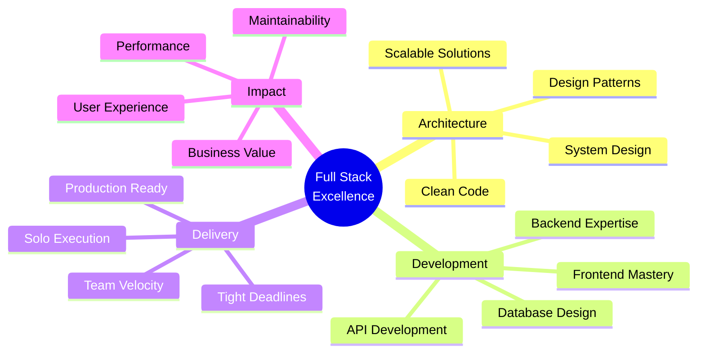

<div align="center">

<!-- Animated Header with Gradient -->


<!-- Dynamic Typing Effect -->
<p align="center">
  
</p>

<!-- Glassmorphic Status Badges -->
<p align="center">
  
  
  
</p>

<!-- Profile Views Counter with Animation -->
<p align="center">
  
  
</p>

</div>

<br/>

<!-- About Section with Gradient Border -->
<div align="center">
  
##  About Me

</div>

```typescript
const chandan = {
    role: "Full Stack Architect",
    mission: "Building production-grade applications that scale",
    approach: "Solo developer with team-level output",
    
    expertise: {
        architecture: ["System Design", "Microservices", "Clean Architecture"],
        development: ["End-to-End Implementation", "Performance Optimization"],
        delivery: ["Tight Deadlines", "Production-Ready Code", "Scalable Solutions"]
    },
    
    differentiators: [
        "🎯 Ship complex features independently",
        "⚡ Write code teams inherit confidently", 
        "🏗️ Own entire product lifecycles",
        "💎 Balance excellence with velocity"
    ],
    
    currentFocus: "Creating impactful solutions that solve real problems",
    availability: "Open to exciting opportunities"
};
```

<br/>

<!-- Tech Stack with Glassmorphic Cards -->
<div align="center">

##  Technology Arsenal

</div>

<div align="center">

### 🎨 Frontend Universe
<p>
  
  
  
  
  
  
</p>

### ⚙️ Backend Powerhouse
<p>
  
  
  
  
  
</p>

### 🗄️ Data & Storage
<p>
  
  
  
  
</p>

### 🛠️ Tools & Workflow
<p>
  
  
  
  
  
</p>

### 🎯 Principles & Practices
<p>
  
  
  
  
</p>

</div>

<br/>

<!-- Featured Projects Section -->
<div align="center">

##  Featured Production Systems

</div>

<div align="center">
<table>
<tr>
<td width="50%" valign="top">

### 🎯 **Productivity & Social Ecosystem**
<div align="left">

**Enterprise-Grade Mobile Platform**

```yaml
Role: Solo Full-Stack Architect
Stack: React Native • Spring Boot • PostgreSQL
Scale: Production-ready mobile application

Core Features:
  ✨ Secure JWT Authentication
  🔄 Real-time Data Synchronization
  📱 Native Mobile Experience
  🗃️ Normalized Database Design
  
Technical Excellence:
  • Architected scalable microservices
  • Designed complex data relationships
  • Implemented secure auth flow
  • Built pixel-perfect responsive UI
```


</div>
</td>
<td width="50%" valign="top">

### 🤖 **AI Language Learning Platform**
<div align="left">

**Intelligent Conversational Coach**

```yaml
Role: Full-Stack Developer
Stack: React Native • Gemini AI • NLP
Scale: AI-powered mobile application

Core Features:
  🧠 AI-Powered Conversations
  ✍️ Real-time Grammar Analysis
  🌐 Multi-language Support
  💬 Context-Aware Responses
  
Technical Excellence:
  • Integrated advanced AI models
  • Built real-time feedback engine
  • Designed intuitive UX flow
  • Optimized API performance
```


</div>
</td>
</tr>

<tr>
<td width="50%" valign="top">

### ✅ **Task Management System**
<div align="left">

**Full-Stack CRUD Application**

```yaml
Role: Full-Stack Engineer
Stack: React • Spring Boot • MySQL • JWT
Scale: Cloud-deployed production app

Core Features:
  🔐 JWT Authentication
  📝 Complete CRUD Operations
  👥 User Management System
  📱 Responsive Design
  
Technical Excellence:
  • RESTful API architecture
  • Secure authentication flow
  • Database relationship design
  • Modern React patterns
```


</div>
</td>
<td width="50%" valign="top">

### 🌦️ **Weather Intelligence App**
<div align="left">

**Real-Time Weather Platform**

```yaml
Role: Frontend Developer
Stack: React • Weather APIs • Modern UI/UX
Scale: Live web application

Core Features:
  🌍 Real-time Weather Data
  📊 Visual Data Representation
  🎨 Clean, Modern Interface
  ⚡ Optimized Performance
  
Technical Excellence:
  • Efficient API integration
  • Error handling & fallbacks
  • Minimalist design system
  • Performance optimization
```


</div>
</td>
</tr>
</table>
</div>

<br/>

<!-- GitHub Stats with Glass Effect -->
<div align="center">

##  GitHub Analytics

<p align="center">
  
  
</p>

<p align="center">
  
</p>

<!-- Contribution Graph -->


</div>

<br/>

<!-- Professional Approach Section -->
<div align="center">

##  Professional Approach

<table>
<tr>
<td align="center" width="25%">
<br>

<br><br>
<h3>🏗️ System Architecture</h3>
<p><i>Design scalable solutions<br/>from database to deployment</i></p>
<br>
</td>
<td align="center" width="25%">
<br>

<br><br>
<h3>⚡ Rapid Execution</h3>
<p><i>Ship production code<br/>under tight deadlines</i></p>
<br>
</td>
<td align="center" width="25%">
<br>

<br><br>
<h3>💎 Code Quality</h3>
<p><i>Clean, tested<br/>maintainable solutions</i></p>
<br>
</td>
<td align="center" width="25%">
<br>

<br><br>
<h3>📚 Continuous Learning</h3>
<p><i>Rapidly adapt to<br/>new technologies</i></p>
<br>
</td>
</tr>
</table>

</div>

<br/>

<!-- What I Bring Section -->
<div align="center">

## 💼 What I Bring to Your Team

</div>

<div align="center">



</div>

<br/>

<!-- Skills Visualization -->
<div align="center">

### 📊 Skill Distribution


<p>
  
  
  
</p>

</div>

<br/>

<!-- Trophy Section -->
<div align="center">

## 🏆 GitHub Achievements


</div>

<br/>

<!-- Let's Connect Section -->
<div align="center">

##  Let's Build Something Amazing

<p align="center">
  <i>Open to opportunities • Ready to contribute • Passionate about impact</i>
</p>

```java
public class Collaboration {
    public static void main(String[] args) {
        Developer developer = new Developer("Chandan");
        
        if (developer.isAvailable() && yourProject.needsExcellence()) {
            Connection.establish("Let's create something remarkable together");
        }
    }
}
```

<br/>

<!-- Social Links with Icons -->
<p align="center">
  <a href="mailto:YOUR_EMAIL@gmail.com">
    
  </a>
  <a href="https://www.linkedin.com/in/chandan-prajapati7/">
    
  </a>
  <a href="https://chandan-s-portfolio.vercel.app/">
    
  </a>
  <a href="https://github.com/chandan944">
    
  </a>
</p>

<p align="center">
  <i>💡 Always excited to discuss: System Architecture • Full Stack Development • Production Engineering</i>
</p>

</div>

<br/>

<!-- Snake Animation -->
<div align="center">
  
</div>

<br/>

<!-- Footer Wave -->


<!-- End Quote -->
<div align="center">
  
### ✨ "Code is like humor. When you have to explain it, it's bad." – Cory House

<p>
  
  
</p>

</div>

---

<div align="center">
  <sub>⭐ From <a href="https://github.com/chandan944">Chandan Prajapati</a> with passion for building exceptional software</sub>
</div>
